# 🎮 SudokuArena – Frontend

**SudokuArena** is the front end of the Sudoku Solver & Player platform. It allows users to play, solve, and track Sudoku puzzles, view personal statistics, and compete via a global leaderboard. Built with **Next.js**, **Chakra UI**, and **React Hook Form**, it connects to the [SudokuSolver REST API](https://github.com/raphaellndr/SudokuAPI).

---

## 🚀 Tech Stack

- **Framework**: [Next.js](https://nextjs.org/)
- **Auth**: [NextAuth.js](https://next-auth.js.org/)
- **Styling**: [Chakra UI](https://chakra-ui.com/)
- **Forms**: [React Hook Form](https://react-hook-form.com/) + [Zod](https://zod.dev/)
- **Data Fetching**: [React Query](https://tanstack.com/query/v5)
- **Charts**: Chakra UI Charts + Recharts
- **Other**: Canvas Confetti, React Toastify, React Icons

---

## 🧭 Pages Overview

### 🏠 Landing Page (`/`)

The landing page provides a quick visual introduction to the website. It includes:

- A welcome message and brief description of SudokuArena.
- Highlights of the main features: playing, solving, and tracking Sudoku progress.
- A step-by-step explanation of how the platform works.

📸 _Screenshots:_
- 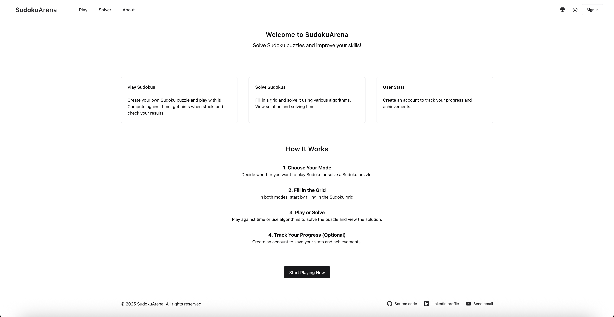

Dark mode is also available. Example:
- 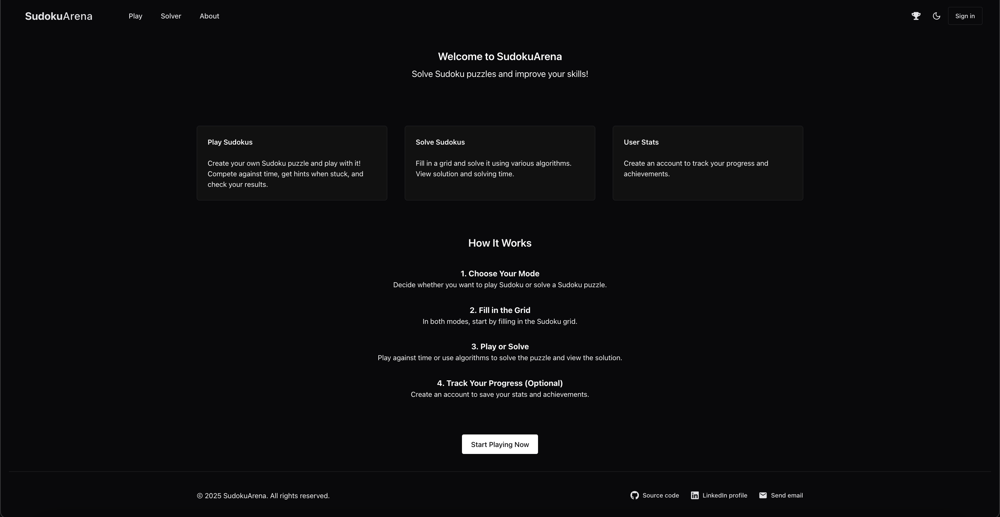

---

### 🔐 Sign In (`/signin`) / Sign Up (`/signup`)

Log in or register with credentials or Google using **NextAuth**.

📸 _Screenshots:_
- 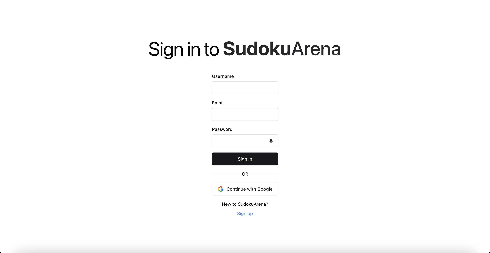
- 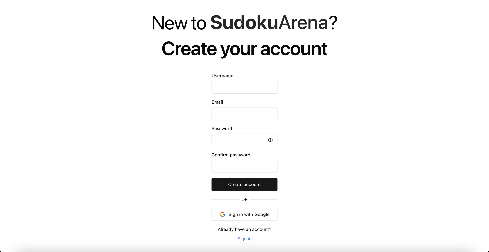

---

### 🎮 Play Page (`/play`)

The **Play** page lets users interactively solve Sudoku puzzles.

- Start by filling in a grid manually or generate a new one.
- Hit **Play** to begin the session — a timer starts and the grid becomes interactive.
- Available controls during the game:
  - ⏸️ **Pause**: Stops the timer and hides the grid.
  - ✅ **Check Cell**: Verify if a selected cell is correct.
  - 💡 **Hint**: Reveal the correct number for a cell.
  - 🔄 **Restart**: Reset the current puzzle and timer.
  - 🚪 **Give Up / New Grid**: End the session and load a new game.

The page also includes:
- 🧾 Instructions on how to play
- 📏 A clear explanation of classic Sudoku rules

📸 _Screenshots:_
- 
- 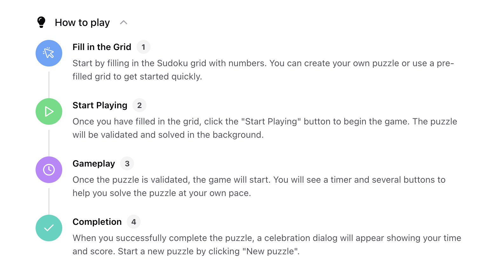
- 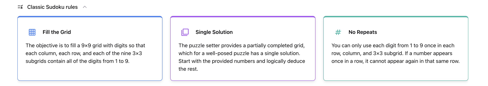
- 
- 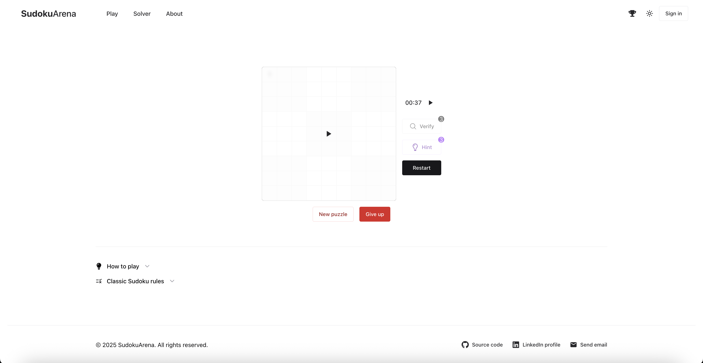
- 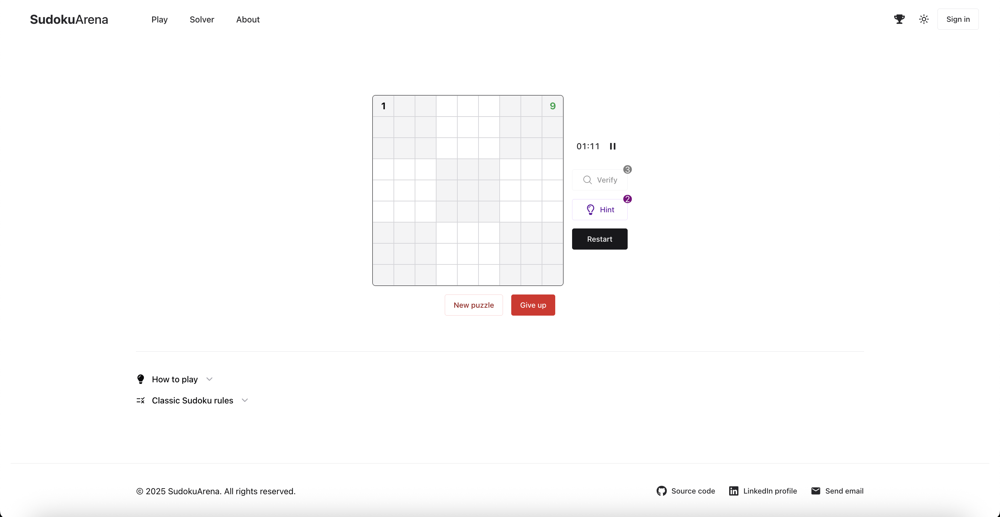
- 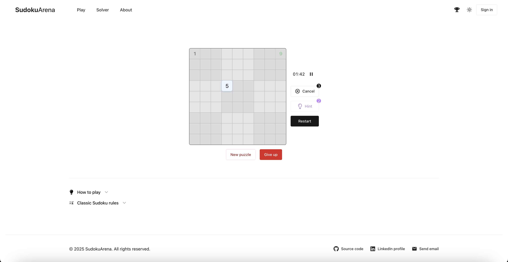
- 

---

### 🧠 Solver (`/solver`)

Solve custom Sudoku puzzles by:
- Manual input
- Image upload (coming soon)
- Backend-powered algorithms

📸 _Screenshots:_
- 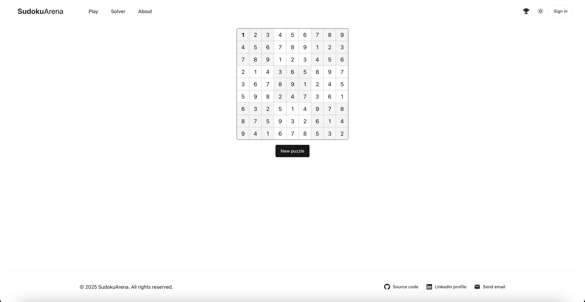

---

### 👤 Profile (`/profile`)

View your:
- Game history
- Stats
- User settings

📸 _Screenshots:_
- 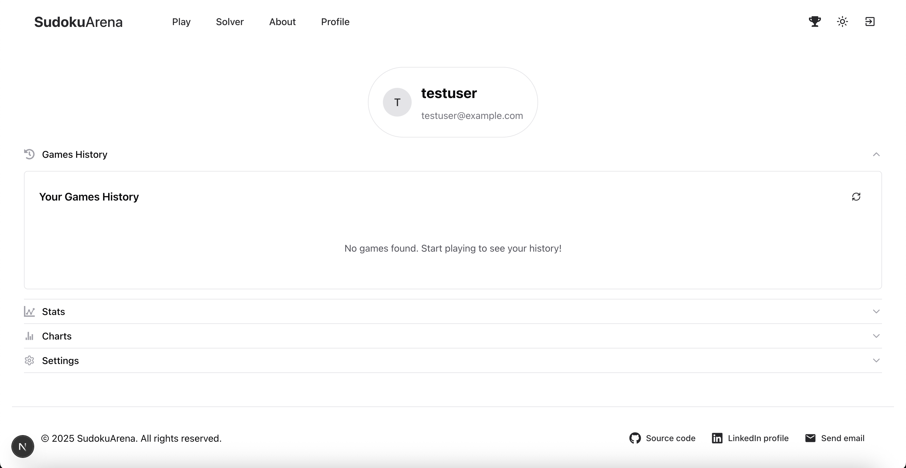
- 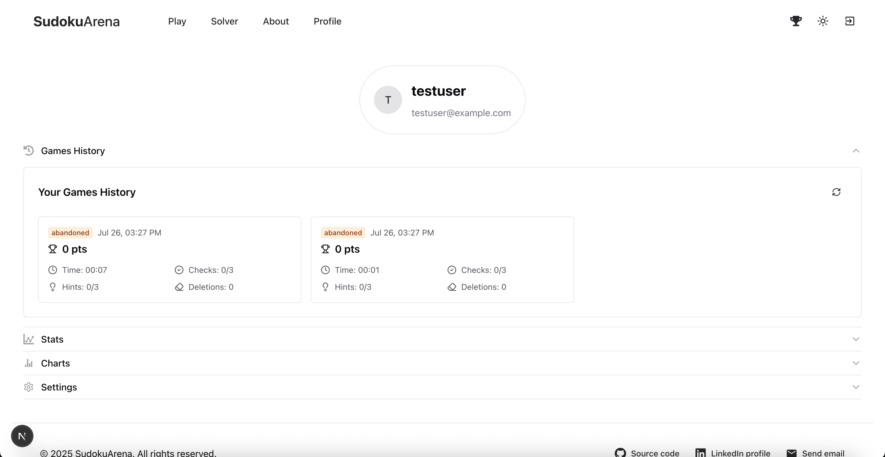
- 
- 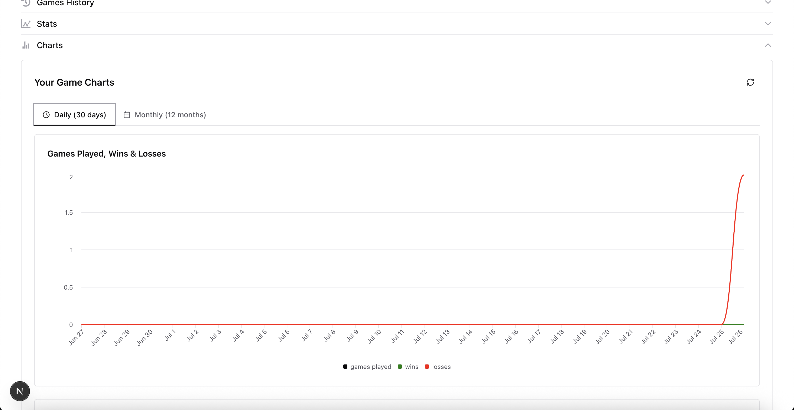
- 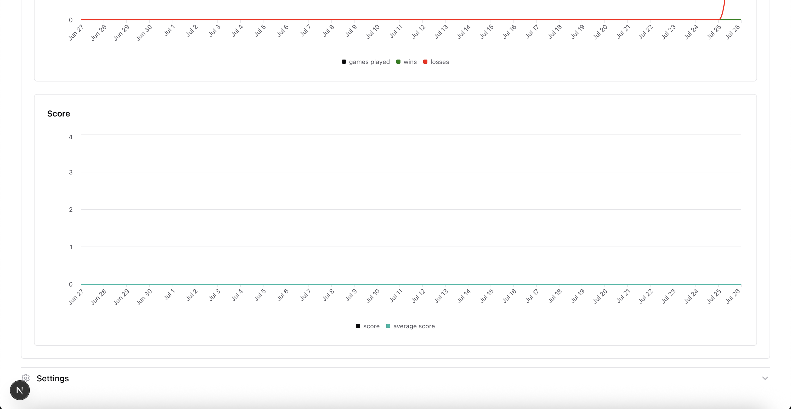
- 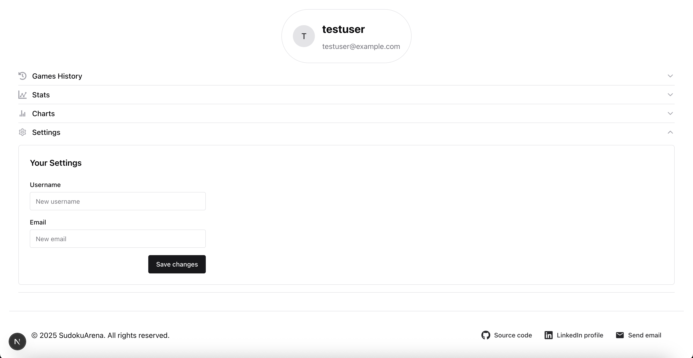

---

### ℹ️ About (`/about`)

Describes my background, the inspiration, the journey and the purpose of the project.

📸 _Screenshots:_
- 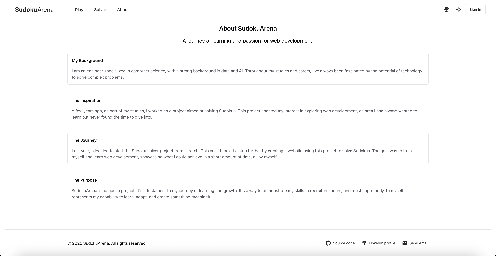

---

### 🧪 Image-Based Sudoku Detection (Experimental)

A new feature is currently in development that allows users to **detect and autofill Sudoku grids from images**.

#### How It Works:

1. **No camera? No problem** – If the current device doesn’t have a back-facing camera (e.g., a desktop), a **QR code** is displayed.
2. **Scan with your phone** – The QR code opens a special capture page on your mobile device.
3. **Capture & Send** – Take a photo of the Sudoku puzzle on your phone. The image is sent to the backend.
4. **Grid Detection & Autofill** – The backend processes the image, detects the grid, and sends it back to the front end to populate the puzzle automatically in **Play** or **Solve** mode.

📌 The backend detection pipeline is already implemented. Frontend integration is in progress.

> ⚠️ This feature is experimental and may evolve based on testing and feedback.

---

### 🔄 Real-Time Feedback via WebSockets

**SudokuArena** uses WebSockets to provide real-time feedback for asynchronous operations, enhancing user experience with timely updates:

- 🧠 **Sudoku Solving**: Get notified when a puzzle sent for solving has completed or not.
- 🖼️ **Image-Based Grid Detection**: After uploading an image for grid detection, receive a real-time notification once the sudoku has been detected. The frontend then fetches and autofills the grid.

> WebSockets are used strictly for **status notifications**, not for real-time multiplayer or board interactions (yet).

---

### 🧭 Global Layout

#### Header

- Clickable logo that redirects to the landing page.
- Navigation: **Play**, **Solver**, **About**, **Leaderboard**.
- Leaderboard that displays top players ranked by total points.
- **Dark/Light Mode** toggle.
- **Sign In / Sign Out** button.
- **Profile** (only if authenticated).

📸 _Screenshots:_
- 
- 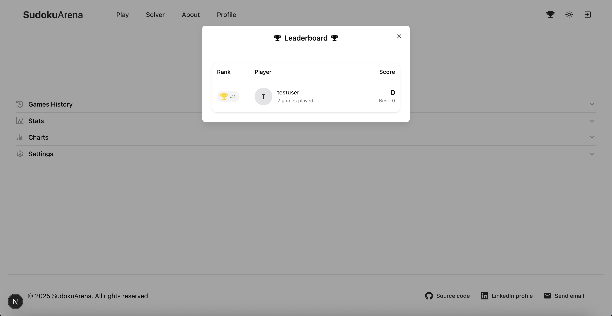

#### Footer

- 🔗 Source Code (GitHub)
- 💼 LinkedIn
- 📧 Email contact

📸 _Screenshots:_
- 

---

## 📁 Project Structure (Simplified)

```
sudokuarena/
├── public/                            # Static files (images, favicon, etc.)
├── src/
│   ├── app/                           # Next.js app directory (routing)
│   │   ├── about/                     # About page
│   │   ├── api/auth/[...nextauth]/   # NextAuth endpoint
│   │   ├── auth/
│   │   │   ├── signin/               # Sign In page
│   │   │   └── signup/               # Sign Up page
│   │   ├── capture/[...uuid]/        # Capture page for image upload
│   │   ├── play/                     # Sudoku Play page
│   │   ├── profile/                  # User Profile
│   │   ├── solver/                   # Sudoku Solver page
│   │   └── leaderboard/              # Leaderboard page
│   ├── components/                   # Reusable UI components
│   ├── enums/                        # Custom enums
│   ├── hooks/                        # Custom React hooks
│   ├── schemas/                      # Zod schemas for forms and validation
│   ├── services/                     # API calls functions
│   ├── styles/                       # Global and theme-specific styles
│   ├── types/                        # TypeScript types and interfaces
│   └── utils/                        # Utility functions
├── .env.local                         # Local environment variables
└── next.config.js                     # Next.js configuration
```

---

## 📄 Environment Variables

Create a `.env.local` file at the root of the project with the following:

```env
NEXTAUTH_URL=http://localhost:3000/
NEXTAUTH_SECRET=your-nextauth-secret
NEXTAUTH_BACKEND_URL=http://localhost:8000/
NEXT_PUBLIC_BACKEND_URL=http://localhost:8000/

GOOGLE_CLIENT_ID=your-google-client-id
GOOGLE_CLIENT_SECRET=your-google-secret
```

---

## 🛠️ Getting Started

```bash
# Install dependencies
npm install

# Run in development
npx next dev

# Build for production
npm run build
npm start
```

---

## 📦 Scripts

```json
"scripts": {
  "dev": "next dev --turbopack",
  "build": "next build",
  "start": "next start",
  "lint": "next lint"
}
```

---

## 📢 Feedback

Have suggestions or found a bug?  
Feel free to open an issue or submit a pull request.  
This is an open-source project built for fun and learning 🎓

---
